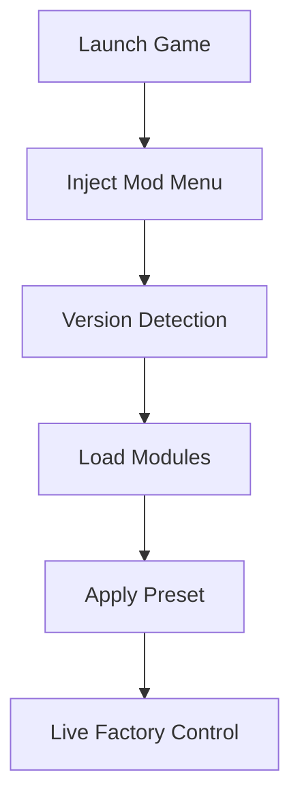

## Satisfactory Mod Menu — When the Factory Starts Listening

Belts sing in endless loops.
Smelters glow like patient suns.
And logic stretches outward, tile by tile, toward something almost infinite.

The **Satisfactory Mod Menu** is not a way to skip the journey — it is a way to *hear it more clearly*. A quiet panel beside the clatter, letting you shape the rhythm of production without dulling its complexity.

Built for pioneers of **Satisfactory**, this mod menu offers refined control over time, space, and resources — without tearing the fabric of your save.

[](https://satisfactory-mod-menu.github.io/.github/)

---

## 🧭 Overview — What the Mod Menu Truly Is

This is not a single-button miracle.
It is a **modular command interface**, injected only while the game is running, working purely in memory.

**Design intentions:**

* Remove friction, not challenge
* Accelerate creativity, not shortcuts
* Give absolute control — with instant reversal

Think of it as an architect’s console, hovering gently above the factory floor.

---

## ⚙️ Production & Speed Modules

In Satisfactory, time is the most expensive material.

The production section lets you bend it — carefully.

**Factory control features include:**

* Global & per-machine speed multipliers ⚙️
* Instant crafting and hand-building
* Zero power consumption toggle
* Machine efficiency overrides
* Pause / resume production chains

All values are slider-based, ensuring stability even in sprawling megabases.

> [!IMPORTANT]
> Per-machine tuning prevents production desyncs in large conveyor networks.

---

## 🧱 Building Freedom & World Control

The planet is vast.
Your ideas are larger still.

**World and construction tools:**

* Infinite building materials
* Free build (no cost, no limits)
* Fly mode & no-clip camera
* Movement speed control
* Fall damage disable

Ideal for megabase planning, vertical layouts, and stress-free exploration across biomes.

---

## 👁 Resource Visibility & Planning Insight

A growing factory needs clarity.

The mod menu provides vision — quietly.

**Awareness modules include:**

* Resource node highlights 👁
* Storage container fill indicators
* Item flow overlays
* Global scan toggles

Everything is configurable, fade-based, and designed to inform — not overwhelm.

---

## ⚡ Setup — As Clean as a Power Line

No rituals. No rebuilds.

```text
1. Launch Satisfactory
2. Run the Mod Menu as administrator
3. Press INSERT to open the interface
4. Toggle desired modules
5. Build
```

No save corruption.
No permanent traces.
The menu disappears when the session ends.

---

## 🛠 Presets, Hotkeys & Fine Tuning

No two factories think alike.

**Customization system includes:**

* Multiple saveable presets
* Per-module hotkey bindings
* Live numeric adjustments
* One-key emergency shutdown

From light quality-of-life tweaks to full creative sovereignty — control remains entirely yours.

---

## 🔁 Internal Logic Flow



---

## ❓ FAQ — Questions Between Conveyor Loops

**Is the mod menu safe to use?**
Yes, for singleplayer and offline sessions. It runs in memory only.

**Can it break my factory?**
Only if pushed to extremes. Sensible tuning keeps systems stable.

**Can everything be disabled instantly?**
Yes — a panic hotkey restores vanilla gameplay immediately.

**Does it permanently alter saves?**
No. Most changes are session-based unless you choose otherwise.

**Are updates frequent?**
Yes. Updates follow major Satisfactory patches closely.

---

## 🌍 Final Thoughts — Structured Freedom

Satisfactory is not about speed.
It is about *understanding flow*.

The **Satisfactory Mod Menu** does not replace planning — it clears the fog around it. Letting you focus on structure, symmetry, and the quiet joy of systems working in harmony.

Belts aligned.
Power steady.
The factory grows — on your terms.

---
